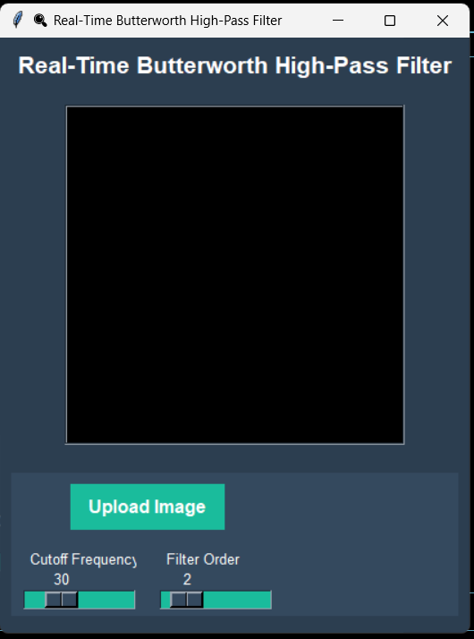

# 🧠 ButterVision: Real-Time Butterworth High-Pass Filter in Digital Image Processing

**ButterVision** is a **Digital Image Processing (DIP)** project that demonstrates the application of the **Butterworth High-Pass Filter** to grayscale images using the frequency domain. It offers a user-friendly graphical interface built with Python and Tkinter, where users can experiment with real-time parameter tuning and observe the effects of frequency filtering.

---

## 🎯 Project Domain

> **Digital Image Processing (DIP)**  
This project focuses on frequency domain filtering techniques, specifically using the Butterworth High-Pass filter to enhance image details and suppress low-frequency components such as background and illumination.

---

## 🚀 Features

- 📤 Upload and preview any grayscale image.
- 🔧 Interactive sliders to adjust:
  - **Cutoff Frequency**: Controls the radius of the high-pass filtering effect.
  - **Filter Order**: Controls the sharpness or steepness of the filter's transition.
- ⚡ Real-time preview of filtered image as you adjust parameters.
- 🎨 Clean and modern GUI using Tkinter.

---

## 🧰 Tools & Libraries Used

| Tool | Purpose |
|------|---------|
| `Python` | Core programming language |
| `Tkinter` | GUI development |
| `OpenCV` | Image reading and preprocessing |
| `NumPy` | FFT-based frequency domain filtering |
| `Pillow (PIL)` | Image format conversion and GUI rendering |

---

## 📸 GUI Screenshot

Here’s a glimpse of the user interface:



---

## 📂 How to Run

### 🛠️ Prerequisites

Install required libraries:

```bash
pip install opencv-python pillow numpy
How_It_Works:
  - step: "User uploads a grayscale image using the 'Upload Image' button."
  - step: "Image is converted to the frequency domain using Fast Fourier Transform (FFT)."
  - step: "A Butterworth High-Pass Filter is applied with parameters:"
    details:
      - "Cutoff Frequency (D0)"
      - "Filter Order (n)"
  - step: "Filtered result is transformed back to the spatial domain using Inverse FFT."
  - step: "The output is normalized and displayed."
  - step: "Slider adjustments dynamically update the filtered image in real-time."

